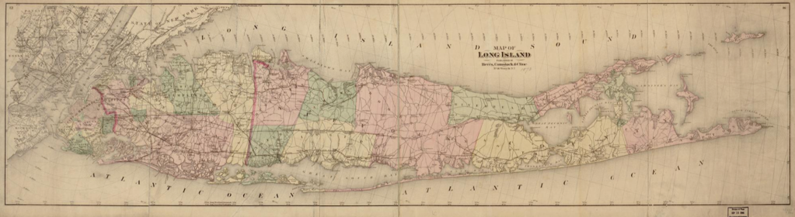
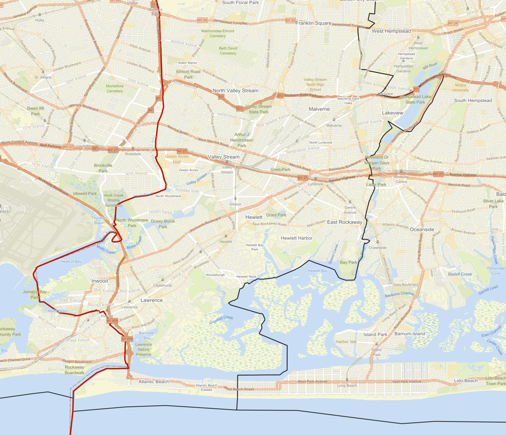
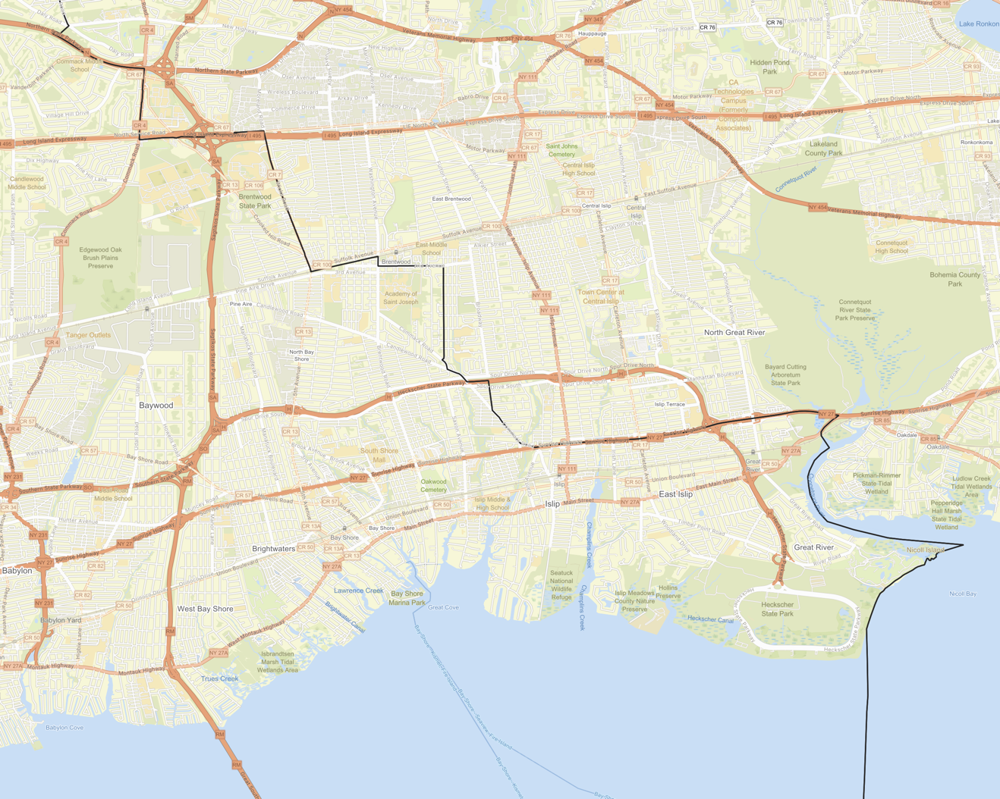
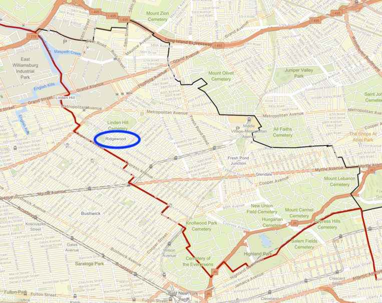

+++
date = '2025-11-01T15:31:31-04:00'
draft = true
title = "Redrawing the Boundaries of Long Island's Counties"
+++

Long Island has four counties: Kings, Queens, Nassau, and Suffolk. Portions of the boundaries of these counties are demarcated by physical features, such as the Newtown Creek between Kings County (the borough of Brooklyn) and Queens, or Cold Spring Harbor between Nassau and Suffolk. But mostly the boundaries between the counties are imaginary lines which were drawn over 350 years ago to separate different jurisdictions, as shown in the image below. 

<figure>
  
  <figcaption>1873 Comstock Map of Long Island showing Kings, Queens, and Suffolk Counties.</figcaption>
</figure>

In everyday language people tend to use the counties as a way to name sub-regions of New York City and Long Island. But for some purposes the division of the island into four counties is misaligned. For example, some people protest that Ridgewood in Queens is "basically Brooklyn", or consider Little Neck, also in Queens, to resemble Nassau County more than the rest of Queens. County boundaries also split certain commonly recognized communities into two pieces, such as Cold Spring Harbor and Farmingdale, which both straddle the border between Nassau and Suffolk Counties. And despite its name, the part of Farmingdale that lies in Suffolk County bears little resemblance to the actual rural communities fifty miles east on the North Fork of Long Island, though they are in the same county. So though the four counties make for easy shorthand for people to divide the island into regions, their colonial-era origin predates the urban and suburban development of the island, which often did not follow the county boundaries. To accomodate this, common social parlance supplements these four county regions with additional terms like Eastern Queens for the portion that includes Little Neck, or the East End for communities like the Hamptons and the North Fork.

Thinking about these **things** inspired me to try redividing Long Island into four regions while adhering to principles that will not split up densely populated ares, which tend to be regional cores, and instead try to place boundaries on the regional periphery where there is less likely to be social, physical, and transportation connectivity between either side of the boundary. In order to do this, went through a few steps:

1. Gathered census tract geography and population data for the four counties of Long Island 
2. Converted census tracts into centroid points and creating an [_Urquhart graph_](https://en.wikipedia.org/wiki/Urquhart_graph) using the centroids of these tracts, ensuring that small island tracts are connected to the rest of the graph by at least one edge while eliminating most long edges that cross water or are not useful to the algorithm. 
3. Assigned the edge weights of the Urquhart graph using the formula described [below](#edge-weightcost-calculation-formula), giving lower edge weight between high-population tracts that are close together and higher edge weight between low-population tracts that are far apart. This reduces the edge weights within regional centers relative to their actual geographic distance.
4. Created an all-nodes distance matrix and input this into a K-Medoids clustering algorithm to split the tracts into four clusters

The K-Medoids algorithm works by iteratively choosing centrally-located nodes, called _medoids_, from a dataset and assigning the rest of the nodes into clusters based on which central node is closest. Therefore, the previous prioritization of lower relative edge weight for high-population tracts with nearby neighbors results in a lower relative likelihood that the tracts at either end of these low-weight high-population edges will end up in different clusters, since their distance to medoid central node will be relatively similar.

### Edge Weight/Cost calculation formula

Given an Urquhart graph whose nodes represent census tracts:

| Cost calculation                                                | Assumption reflected in the calculation                                                                                                                                                                        | Additional notes                                                                                                                           |
|-----------------------------------------------------------------|----------------------------------------------------------------------------------------------------------------------------------------------------------------------------------------------------------------|--------------------------------------------------------------------------------------------------------------------------------------------|
| dist or dist/2 + dist/2                                         | the cost of traveling from tract A to B, and therefore their disconnectedness, is proportional to the distance needed to get there                                                                             | used haversine formula to calculate greate circle distance                                                                                 |
| dist/2 (sqrt(pop_a)) + dist/2 (sqrt(pop_b))                     | the average distance between people on a path from A to B is proportionate to sqrt(population) for equal area places (interpolating the disconnectedness between tract A and tract B based on tract population) | pop_a is the population of census tract A and pop_b is the population of census tract B, when these tracts are considered to be neighbors. |
| (dist/2 (sqrt(pop_a)) + dist/2 (sqrt(pop_b)))^2                 | the frequency of going between tract A and tract B is inversely related to the resources spent getting there. the above disconnectedness measure is squared.                                                   |                                                                                                                                            |
| ((dist/2 (sqrt(pop_a)) + dist/2 (sqrt(pop_b)))^2)/(pop_a/pop_b) | the frequency of connections between tract A and B is related to the combined population of the tracts, i.e. the disconnectedness is inversely related to population.                                          |                                                                                                                                            |
|                                                                 |                                                                                                                                                                                                                |                                                                                                                                            |

Thus the final cost calculation for edges between tract A and tract B is `((dist/2 (sqrt(pop_a)) + dist/2 (sqrt(pop_b)))^2)/(pop_a/pop_b)`

The intention in creating such a cost calculation is to induce the k-medoids algorithm to cluster locations together when they are likely to have a higher amount of traffic between them. The borders between two clusters should then in theory be areas of lower population or more separation between populations.

## K medoids result

The K-medoids is useful as a sort of voronoi algorithm for graphs. As mentioned before, it iteratively selects "medoids" (central nodes) and assigns other nodes to the cluster of the nearest medoid based on the distance matrix provided. Then whichever node in this cluster has the shortest cumulative weight to every other edge in the cluster becomes the new medoid for the next iteration. This continues until convergence or until a set number of iterations is reached.

After running the K-Medoids algorithm with k=4, I obtained the following clusters for the census tracts of Long Island:

By design, the K-medoids algorithm will give a medoid: a centrally located node that for the purposes of this algorithm can be thought of as the "county seat" of each of these new counties.

Here are the populations and seats of these "New Counties" as of the 2020 Census, from west to east:

| New County                      | New County Seat                     | Population |
|---------------------------------|-------------------------------------|------------|
| New Brooklyn (New Kings County) | Prospect-Leffert Gardens / Flatbush | 2,963,981  |
| New Queens                      | Kew Gardens Hills                   | 2,607,754  |
| New Nassau                      | Levittown                           | 1,506,479  |
| New Suffolk                     | Farmingville                        | 985,018    |

In the above image, the real county boundaries are shown in red. We can see here that the "new" counties are all moved eastward such that "new" Suffolk is significantly smaller than the real Suffolk County.

This algorithm on its own is not perfect. Part of Glen Cove was made an exclave of New Queens while being connected by land only to New Nassau.

Mostly though, the boundaries between the New Counties follow bodies of water, owing to the design of my algorithm which tends to keep neighboring densely-populated tracts in the same cluster while placing boundaries in low-population areas.

Highways, the Long Island Railroad, and the Connetquot River form much of the boundary between New Nassau and New Suffolk.

There are also some interesting changes related to localities I mentioned earlier. Ridgewood, Queens, which borders Bushwick in Brooklyn, is now included in New Brooklyn.

Additionally, Cold Spring Harbor and Farmingdale, both straddling the straight line that separates Nassau and Suffolk Counties, are now both included in New Nassau.

This was mostly just a fun project for me, but similar principles and algorithms can be used for applications like redistricting or subdividing organizations and clubs geographically.

Will make Git repo available soon!