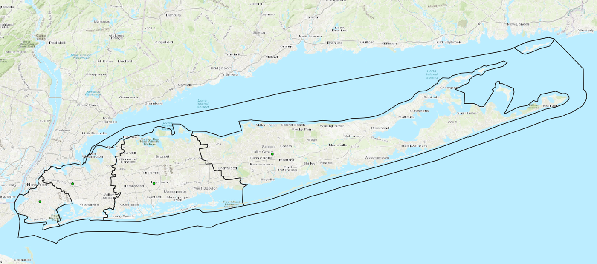
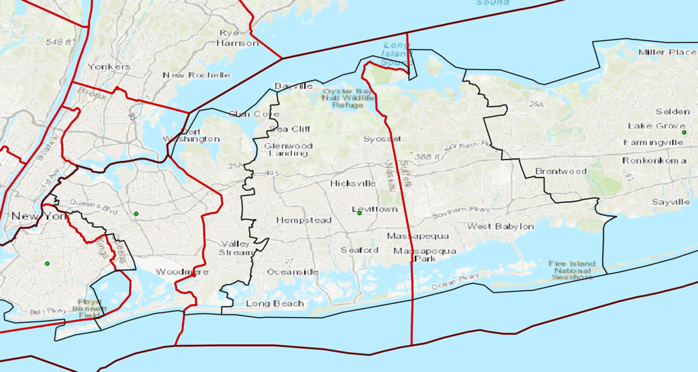
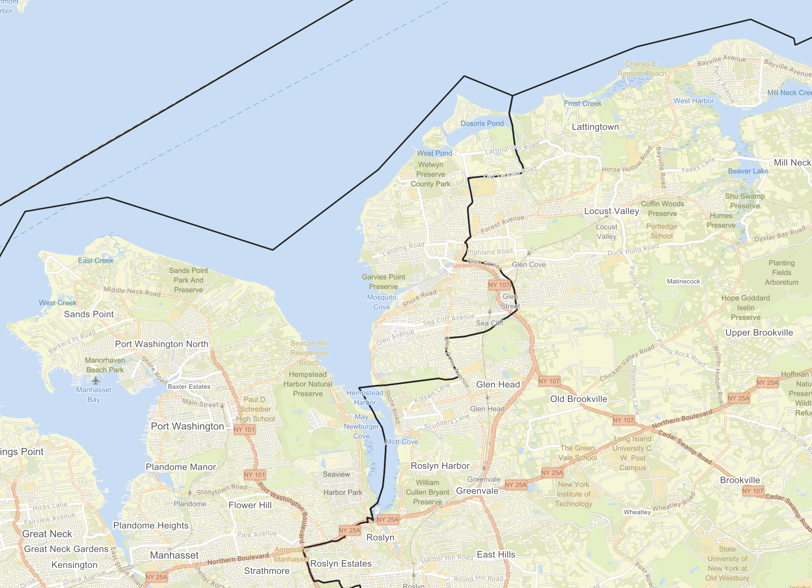

+++
date = '2025-11-01T15:31:31-04:00'
draft = false
title = "Redrawing the Boundaries of Long Island's Counties"
+++

Long Island has four counties: Kings, Queens, Nassau, and Suffolk\*. Portions of the boundaries of these counties are demarcated by physical features, such as the Newtown Creek between Kings County (the borough of Brooklyn) and Queens, or Cold Spring Harbor between Nassau and Suffolk. But mostly the counties are separated by political boundaries which were drawn over 350 years ago to establish county and town-level governing institutions in the colony, and later the state, of New York. 

\* Kings and Queens Counties are better known as the boroughs of Brooklyn and Queens, respectively, within New York City. In common usage the term "Long Island" often excludes the part of the island within New York City so that such usage includes only Nassau and Suffolk Counties. 
{style="font-size:0.8em"}

[//]: # (![1873 Comstock Map of Long Island showing Kings, Queens, and Suffolk Counties]&#40;comstock-li.png&#41;)



In everyday language, people tend to use the counties as a way to name sub-regions of New York City and Long Island. But for some purposes the division of the island into four counties is misaligned. For example, some people protest that Ridgewood in Queens is "basically Brooklyn", or consider Little Neck, also in Queens, to share more in common with Nassau County than with the rest of Queens. County boundaries also split certain commonly recognized communities into two pieces, such as Cold Spring Harbor and Farmingdale, which both straddle the border between Nassau and Suffolk Counties. Suffolk County is also an example of how one county can contain disparate locales: the suburban community of Farmingdale, with its frequent trains service to Manhattan, is a far cry from the actual farming communities in the county's North Fork. So though the four counties make for easy shorthand for people to divide the island into regions, their colonial-era origin predates the urban and suburban development of the island, which often did not follow the county boundaries.

Thinking about these mismatches inspired me to try redividing Long Island into four regions while adhering to principles that will not split up densely populated areas, which tend to be regional cores, and instead try to place boundaries on the regional periphery where there is less likely to be social, physical, and transportation connectivity between either side of the boundary. In order to do this, I went through a few steps:

1. Gathered census tract geography and population data for the four counties of Long Island 
2. Converted census tracts into centroid points and created an [_Urquhart graph_](https://en.wikipedia.org/wiki/Urquhart_graph) using the centroids of these tracts, ensuring that small island tracts are connected to the rest of the graph by at least one edge while eliminating most long edges that cross water or are not useful to the goal of clustering together nearby areas. 
3. Assigned the edge weights of the Urquhart graph using the formula described [below](#edge-weightcost-calculation-formula), giving weight to edges connecting high-population tracts that are close together and higher weight to edges connecting low-population tracts that are far apart. This reduces the edge weights within regional centers relative to their actual geographic distance.
4. Created an all-nodes distance matrix to use as input to a K-Medoids clustering algorithm. Configured the K-Medoids algorithm to group the tracts into four clusters



The K-Medoids algorithm works by iteratively choosing centrally-located nodes, called _medoids_, from a dataset and assigning the rest of the nodes into _k_ number of clusters based on which central node is closest. Therefore, my aforementioned prioritization of lower relative edge weight for high-population tracts with nearby neighbors results in a lower relative likelihood that the tracts at either end of these low-weight high-population edges will end up in different clusters, since their distance to the medoid node will be relatively similar.

### Edge Weight/Cost calculation formula

Given an Urquhart graph whose nodes represent census tracts:

| Cost calculation                                                | Assumption reflected in the calculation                                                                                                                                                                        | Additional notes                                                                                                                           |
|-----------------------------------------------------------------|----------------------------------------------------------------------------------------------------------------------------------------------------------------------------------------------------------------|--------------------------------------------------------------------------------------------------------------------------------------------|
| dist or dist/2 + dist/2                                         | the cost of traveling from tract A to B, and therefore their disconnectedness, is proportional to the distance needed to get there                                                                             | used haversine formula to calculate great circle distance                                                                                 |
| dist/2 (sqrt(pop_a)) + dist/2 (sqrt(pop_b))                     | the average distance between people on a path from A to B is proportionate to sqrt(population) for equal area places (interpolating the disconnectedness between tract A and tract B based on tract population) | pop_a is the population of census tract A and pop_b is the population of census tract B, when these tracts are considered to be neighbors. |
| (dist/2 (sqrt(pop_a)) + dist/2 (sqrt(pop_b)))^2                 | the frequency of going between tract A and tract B is inversely related to the resources spent getting there. the above disconnectedness measure is squared.                                                   |                                                                                                                                            |
| ((dist/2 (sqrt(pop_a)) + dist/2 (sqrt(pop_b)))^2)/(pop_a/pop_b) | the frequency of connections between tract A and B is related to the combined population of the tracts, i.e. the disconnectedness is inversely related to population.                                          |                                                                                                                                            |
|                                                                 |                                                                                                                                                                                                                |                                                                                                                                            |

Thus the final cost calculation for edges between tract A and tract B is `((dist/2 (sqrt(pop_a)) + dist/2 (sqrt(pop_b)))^2)/(pop_a/pop_b)`

The intention in creating such a cost calculation is to induce the K-Medoids algorithm to cluster locations together when they are likely to have a higher amount of traffic between them. The borders between two clusters should then in theory be areas of lower population or more separation between populations.

## K-Medoids Result

K-Medoids is useful as a sort of Voronoi algorithm for graphs. As mentioned before, it iteratively selects _k_ number of "medoids" (central nodes) and assigns other nodes to the cluster of the nearest medoid based on the distance matrix provided. Then whichever node in this cluster has the shortest cumulative weight to every other edge in the cluster becomes the new medoid for the next iteration. This continues until convergence or until a set number of iterations is reached.

After running the K-Medoids algorithm with k=4, I obtained the following clusters for the census tracts of Long Island:

By design, the K-Medoids algorithm will give a medoid: a centrally located node that for the purposes of this exercise can be thought of as a center of gravity, or "county seat" of each of these new counties.

Here are the populations and seats of these "New Counties" as of the 2020 Census, from west to east:

| New County                      | New County Seat                     | Population |
|---------------------------------|-------------------------------------|------------|
| New Brooklyn (New Kings County) | Prospect-Leffert Gardens / Flatbush | 2,963,981  |
| New Queens                      | Kew Gardens Hills                   | 2,607,754  |
| New Nassau                      | Levittown                           | 1,506,479  |
| New Suffolk                     | Farmingville                        | 985,018    |

In the above image, the real county boundaries are shown in red while my "New Counties" are demarcated by black lines. We can see here that the "New" counties are all shifted eastward such that "New" Suffolk is significantly smaller than the real Suffolk County.

## Examining the boundaries

Sometimes my algorithm did not perfectly preserve the clustering together of nearby densely populated regions. Part of Glen Cove, a more densely populated area of the North Shore of Nassau County, was made an exclave of New Queens while being connected by land only to New Nassau.

Other than this, the boundaries between the New Counties do not create exclaves, and often follow bodies of water or run through unpopulated areas, owing to the design of my algorithm which tends to keep neighboring densely-populated tracts in the same cluster while placing boundaries in low-population areas.




There are also some interesting changes related to localities I mentioned earlier. Ridgewood, Queens, which borders Bushwick in Brooklyn, is now included in New Brooklyn.

{{< figure
src="ridgewood1.png"
alt="Ridgewood, Queens is in close proximity to Bushwick in Brooklyn, while mostly being separated by cemeteries from the rest of Queens. In including Ridgewood in New Brooklyn (black line), my algorithm reflects the spatial separation between Ridgewood and other parts of Queens, and the closeness between Ridgewood and Brooklyn neighborhoods. The real-life boundary between Brooklyn and Queens is shown in red."
caption="Ridgewood, Queens is in close proximity to Bushwick in Brooklyn, while mostly being separated by cemeteries from the rest of Queens. In including Ridgewood in New Brooklyn (southwest of the black line), my algorithm reflects the spatial separation between Ridgewood and other parts of Queens, and the closeness between Ridgewood and Brooklyn neighborhoods. The real-life boundary between Brooklyn and Queens is shown in red."
>}}

Additionally, Cold Spring Harbor and Farmingdale, both straddling the straight red line that separates Nassau and Suffolk Counties, are now both included near the middle of New Nassau (within the black boundary).

{{< figure
src="csh-and-farmingdale.png"
alt="Cold Spring Harbor and Farmingdale, circled in purple, both straddle the line between Nassau and Suffolk Counties. The village of Cold Spring Harbor is within Suffolk County, but its high school serves students in nearby Nassau County, and the esteemed Cold Spring Harbor Laboratory is also located in Nassau County. Farmingdale has an opposite situation: its incorporated village is completely within Nassau County, but there is Farmingdale State College and Republic Airport, two of the locality's most well-known institutions, are both located outside of the village in Suffolk County. The creation of New Nassau unifies both Cold Spring Harbor and Farmingdale so that each locality is located only in one so-called county."
caption="Cold Spring Harbor and Farmingdale, circled in purple, both straddle the line between Nassau and Suffolk Counties. The village of Cold Spring Harbor is within Suffolk County, but its high school serves students in nearby Nassau County, and the esteemed Cold Spring Harbor Laboratory is also located in Nassau County. Farmingdale has an opposite situation: its incorporated village is completely within Nassau County, but Farmingdale State College and Republic Airport, two of the locality's most well-known institutions, are both located outside of the village in Suffolk County. The creation of New Nassau unifies both Cold Spring Harbor and Farmingdale so that each locality is located only in one so-called county."
>}}

## Final Words

This was mostly just a fun project for me, but similar principles and algorithms can be used for applications like redistricting or subdividing organizations and clubs geographically.

The Git repository for this project is available [here](https://github.com/donovanrichardson/block-county)
