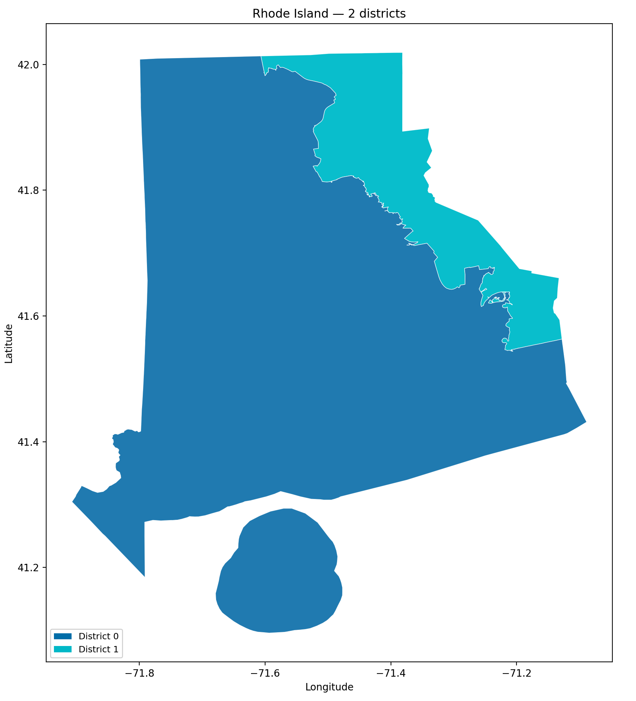
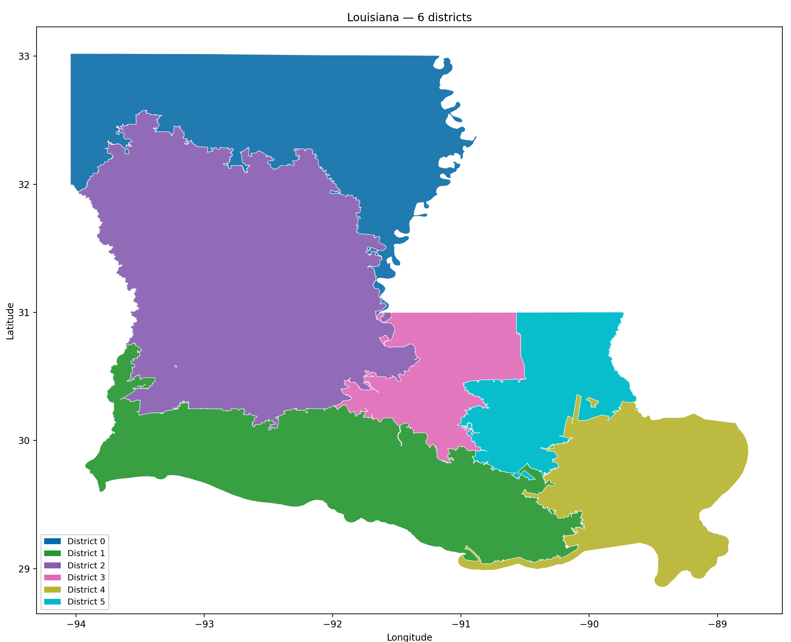
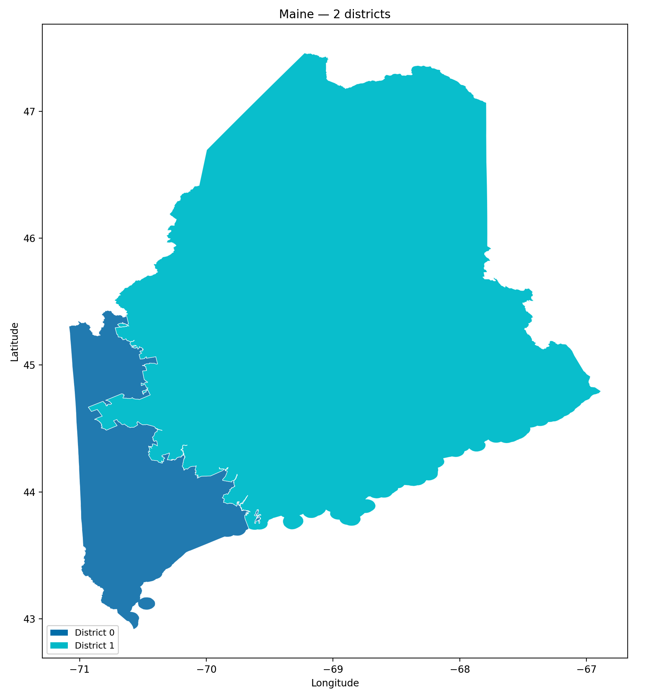

## Intro

In my previous blog posts, I have written about spatial clustering projects in which I have used k-medoids algorithm to divide regions into a number of spheres of influence based roughly on population density and proximity.
The purpose of that was to define regions that are usually defined using arbitrary/historical borders by instead organizing them into *nodal areas* consisting of a nucleus and its catchment area, which may better represent real-world conceptualizations of the region.
Recently, I have decided to use similar principles to create a redistricting algorithm based on METIS.

Source code is available at https://github.com/donovanrichardson/redistrict

## Why METIS?

After using the k-medoids graph algorithm mentioned in previous blog posts, I saw that similar principles could be used to create equal-population districts from census data.
In researching how to accomplish this I came across the METIS algorithm, which is useful for partitioning graphs in a way that obeys various constraints.
The relevant constraints here are minimum cut (partitioning the graph along fewest edges, or the along edges with the lowest cumulative weight) while ensuring that the number of nodes, or the cumulative weight of the nodes, is as equal as possible.
Min cut is relevant to redistricting because in non-compact "gerrymandered" districts, long zig-zagging borders between districts can only be achieved when more edges than necessary are divided by the district.
Imagine a 10-by-10 grid in which 50 blocks are in one district and 50 blocks are in the other. 
In a simple districting where the top five rows are in one district and the bottom five are in another, there are just ten block edges which define the border between the two districts. 
But in an extreme gerrymander scenario where district A contains the top row, district B contains the bottom row, and the other 8 rows contain ten columns alternating between columns in district A and columns in district B, there are 74 block edges that define the border between the two districts. 
Yet each district is continuous and there is no need to traverse through district B in any path between two blocks in district A, and vice-versa.
Because METIS will prefer a minimal edge cut, it will favor the first compact district example with 5 rows on top for district A and 5 rows on the bottom for B.

## Centrality preference

A principle for districts that I regard as important is that district boundaries be located in as sparsely-located places as possible.
When district borders are located away from densely popualted areas, this reduces the likelihood that a cohesive and centrally located area may be split into two districts unnecessarily.
My way to ensure this when using k-medoids, knowing that the catchment area, or cluster, of each medoid is the set of nodes that is closer to the medoid than to any other medoid, was to inflate the weight of edges connecting sparsely populated places such that the cut-over point from one medoid to the other was most likely reached within these high weight edges, while densely populated nodes would have lower weight edges between them that were much less likely to cross the threshold from one medoid to another.
This was achieved by a formula roughly equal to edge weight being the geographical distance betwen nodes divided by the square root of the population of the two nodes.

Considering this, I attempted to use the METIS to create redistricting map based on a minimal cut census tracts in various states and evaluate the results. 
But I hadn't decided on an edge weight formula, so I tried a few:
First I used the reciprocal of the population-based formula which I had used in k-medoids, but using the square root of census tract population divided by geographical distance was not ideal since it tended to produce long gerrymander-looking districts.
I then decided to weight edges as the reciprocal of their geographic length, which gave a similar result
Counterintuitively, weighting all edges equally yielded the compact and core-respecting districts that I desired.
I realized that because the US Census Bureau tries to make census tracts fall within a certain range of population regardless of the physical area of the tract.
This makes the tract graph somewhat resmeble a dot-density map, reducing some of the of the input data.
Importantly, this means that a min cut will tend to occur at edges that connect large, sparsely-populated tracts.
Consequently, I did not need to modify edge weight to obtain a desired result when using METIS to redistrict.

## Other considerations

I will not go through all of the decisions that I made in this redistricting algorithm, but below are a few.

#### Census Tract population

The [Census Bureau](https://www2.census.gov/geo/pdfs/partnerships/psap/G-650.pdf) tries to keep tracts around 4000 people, with variation between 1,200 to 8,000 people. For each run of the algorithm, I evaluate the population of the median populated census tract in the state. Then I bisect census tracts that exceed double this number until there are no more tracts to bisect. Some tracts may be bisected more than once, and rarely there may be individual census blocks which exceed this number and therefore cannot be bisected.

#### Disconnected areas

In states with a large number of islands or prominent water features, connecting islands or disjoint land areas to the mainland is necessary for METIS to successfully split states into multiple distrcts. 
Experimenting with Rhode Island, the smallest state, which has two congressional districts and many islands and disjoint land areas, was a fruitful exercise in calibrating a strategy of connecting disjoint areas for the METIS run.
I settled on a method which makes limited connections between different landmasses to ensure that places like Block Island and Newport Island can be conneted sensibly to the rest of Rhode Island without creating links that may seem to place these islands in totally incorrect districts. This is still a work in progress, and I anticipate that for some states I will need to introduce a functionality in which links cannot be made between certain areas. For example, Nassau County should not be directly connected to Westchester County or the Bronx in any run, since there are not transportation connections between these places. Similarly, there should not be any link made between Staten Island and Western New York. Both of these have happened in various runs of this algorithm.

## Gallery

Below I show you some results of the algo:

